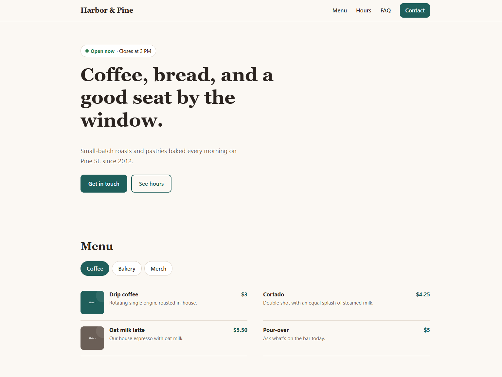
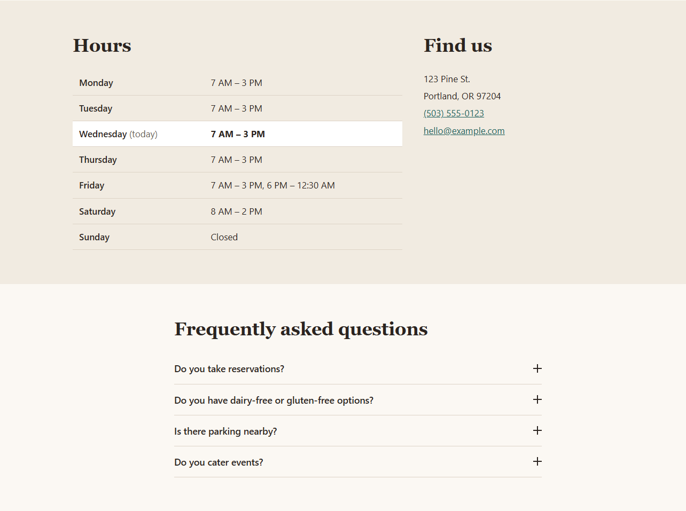
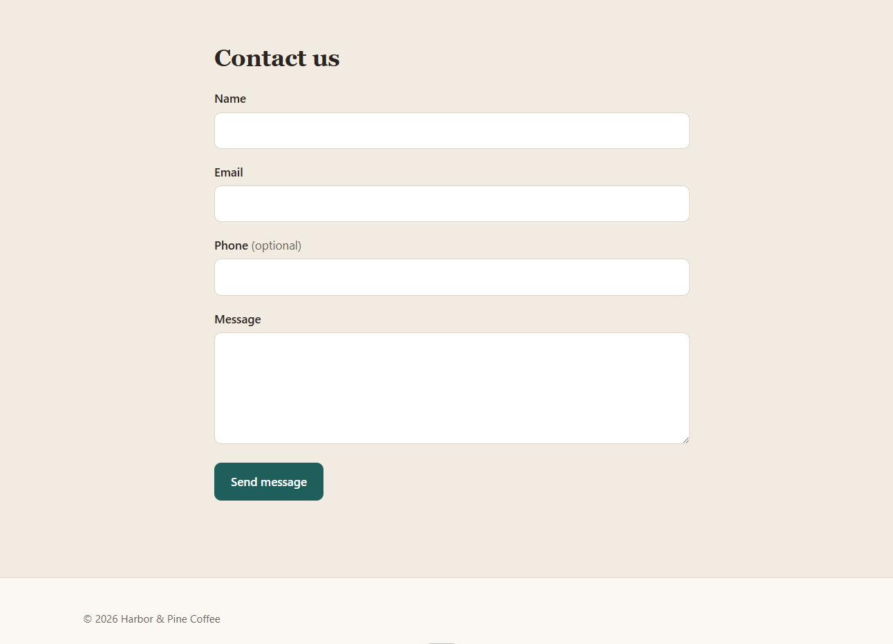

# Small-Business Site Frame

A reusable one-page starter for local businesses, built with [Alpine.js](https://alpinejs.dev) and no build step.

Includes a mobile nav, an "Open now" hours widget, an FAQ accordion, a menu / gallery section with a lightbox, and a validated contact form.

## Screenshots

The template as it ships, filled in for a sample coffee shop, "Harbor & Pine".

**Hero and menu.** The "Open now" badge is calculated live in the business's time zone. Category filters switch the menu, and items with photos open in a lightbox.



**Hours, location and FAQ.** Today's row is highlighted automatically, including hours that run past midnight (Friday). The FAQ is an accessible accordion.



**Contact form.** Validated in the browser, with a hidden spam trap, and it shows a clear error instead of fake success if it can't send.



## Run it

The website lives in **`site/`**. Open `site/index.html` in a browser. That's it. Alpine is included in `site/js/vendor/`, so it works offline.

If you'd rather use a local server (closer to how the live site behaves), run one of these **from the project root** and open http://127.0.0.1:8000:

```sh
python -m http.server 8000 --bind 127.0.0.1 --directory site
npx --yes serve@14.2.6 -l tcp://127.0.0.1:8000 site
```

Both commands serve only `site/` and only to your own computer. **Don't drop `--bind 127.0.0.1` / `127.0.0.1`**: without it, anyone on the same Wi-Fi can browse what you're serving. **Don't serve the project root**: it contains `.git/` and other project files that don't belong on a website. The `serve` version is pinned so `npx` doesn't download whatever is newest.

## Reuse it for a new business

Start the client's site from a copy of **the `site/` folder only**, not the whole project. Anything outside `site/` (`.git/`, `docs/`, `tests/`, this README) is for working on the template and doesn't belong on a client site. All paths below are inside `site/`.

For how the components work and how to change them safely (the Content-Security-Policy rules, upgrading Alpine, troubleshooting), see [docs/ALPINE-APP-DOCUMENTATION.md](docs/ALPINE-APP-DOCUMENTATION.md).

> **Everything in `site/` is public.** Anyone can read every file in it, including `js/site-config.js`. Never put API keys, tokens or passwords anywhere in `site/`. Use only the form provider's **public** form URL. If a provider needs a secret key, it needs a server-side function, which this template doesn't have.

1. **`js/site-config.js`**: time zone, weekly hours, FAQ entries, menu / gallery items (and whether they show as a menu list or a photo grid), and the form endpoint.
2. **`index.html`**: business name, headline, address, phone, and email.
3. **Changing the page's behaviour:** the site uses Alpine's CSP build, so the HTML can't contain JavaScript expressions. Every `x-`, `:` and `@` attribute names a property or method from `js/components.js`, such as `x-text="item.name"` or `@click="close"`. Put any logic (comparisons, `!`, string building) in a getter or method there. The comment at the top of `components.js` explains how.
4. **`css/styles.css`**: brand colors and fonts are the variables at the top under `:root`.
5. **`images/`**: replace the placeholder images and update the paths in the config. **Use JPG, PNG or WebP for photos. Don't accept SVG files from clients without sanitizing them first**, because an SVG can contain scripts. Give every image `alt` text.
6. **Before launch**: work through [Deploying](#deploying) and the [pre-launch checklist](#pre-launch-checklist).

### Contact form

`formEndpoint` in `js/site-config.js` is where the form sends messages. It must be a form service that accepts JSON POSTs (e.g. Formspree, Basin, Getform) and must be a full `https://` URL with no username or password in it.

> **A site must not go live with an empty `formEndpoint`.**
> Leaving it empty is only for local development. On `file://` or `localhost`, submissions are logged to the browser console instead of being sent. On any other host, an empty endpoint makes the form show "Something went wrong", so visitors aren't told their message was sent when it wasn't.

When you set the endpoint, also add the service's origin (e.g. `https://formspree.io`) to `connect-src` in the Content-Security-Policy, in **both** `index.html` and `_headers`. If you don't, the browser blocks the request and the form shows its error message.

## Deploying

The site is static. **Publish only the `site/` folder**: never the project root.

- **Netlify / Cloudflare Pages (Git deploy):** set the publish directory (Cloudflare: "build output directory") to `site`. Leave the build command empty.
- **Drag-and-drop upload:** drag the `site/` folder, not the project folder.
- **Any other static host:** upload the *contents* of `site/`.

After deploying, check that `/.git/config`, `/README.md` and `/docs/` return 404 on the live URL. `site/_redirects` also hides project paths on Netlify if they're ever uploaded by mistake. Cloudflare Pages doesn't support 404 rules in `_redirects`, so there, publishing only `site/` is the protection.

**Security headers.** Some protections, such as blocking the page from being framed by other sites and forcing HTTPS, can only be set by the host as HTTP headers. The template ships a `_headers` file for **Netlify** and **Cloudflare Pages**, which pick it up automatically from the root of the published folder. On another host, copy the same headers into its config (`vercel.json` on Vercel, the server config on Apache or nginx).

**HTTPS (HSTS).** By default `_headers` forces HTTPS for the client's site only. Add `; includeSubDomains` to the `Strict-Transport-Security` line **only after confirming that every subdomain of the client's domain serves HTTPS**. Browsers remember the setting for a year and it can't be undone, so an HTTP-only subdomain (old webmail, a booking system) would stop working.

**Content-Security-Policy.** The CSP exists in two places that must stay in sync: the `<meta>` tag in `index.html` and the `Content-Security-Policy` line in `_headers`. The header version adds `frame-ancestors 'none'` and `upgrade-insecure-requests`, which don't work in a `<meta>` tag.

**Form provider settings.** The browser's checks are only a convenience for visitors. Anyone can POST straight to the endpoint, so the protection has to be set up at the form provider:

- server-side validation (required fields, email format, length limits: name 100, email 254, phone 30, message 5,000 characters)
- spam protection (reCAPTCHA or Cloudflare Turnstile) and rate limiting
- submissions restricted to the client's domain
- notification emails sent as plain text (or properly escaped)

## Pre-launch checklist

Complete this for every new client site:

- [ ] The client site was created from a copy of **`site/` only**, not the whole project folder
- [ ] `formEndpoint` is set, uses `https://`, and a real test submission arrived in the client's inbox
- [ ] **No secrets anywhere in `site/`.** `formEndpoint` is the provider's public form URL, with no credentials in it
- [ ] The form provider has server-side validation, spam protection (reCAPTCHA or Turnstile) and a domain restriction turned on, and sends plain-text notifications
- [ ] The CSP `connect-src` in **both** `index.html` and `_headers` matches the origin of `formEndpoint`
- [ ] The headers file is deployed, and a header scan of the live URL passes (e.g. securityheaders.com)
- [ ] `/.git/config`, `/README.md` and `/docs/` return 404 on the live URL
- [ ] **HSTS:** `includeSubDomains` is added only after confirming every subdomain of the client's domain serves HTTPS
- [ ] `timeZone` and `hours` are checked: the "Open now" badge is correct at a known time
- [ ] No console errors or CSP violations on the live site
- [ ] Client photos are JPG, PNG or WebP (no unsanitized SVGs), and every image has `alt` text
- [ ] Placeholder contact details (`hello@example.com`, phone, address) are replaced
- [ ] Keyboard-only walkthrough: skip link, nav, filters, lightbox, FAQ and form
- [ ] **The security and deployment tests pass against this client's `site/` copy:** `node tests/browser-test.mjs --client <path-to-client-site>` (see [Tests](#tests)). Any `--allow` exception is recorded, with the reason, in the client register.
- [ ] **The Alpine version was checked** against the latest release and security advisories
- [ ] **The site is added to the client register** with the template release it was copied from, its live URL, its form provider and any `--allow` exceptions. Keep the register private, outside `site/`.

## Files

```
site/                    THE WEBSITE: the only folder that is deployed or copied for a client
  index.html             Page markup; each feature is an x-data component
  404.html               "Page not found" page
  _headers               Security headers for Netlify / Cloudflare Pages
  _redirects             Guard that hides project files if uploaded by mistake (Netlify)
  css/styles.css         All styles, mobile-first
  js/site-config.js      Per-business data (window.SITE)
  js/components.js       Alpine components + hours calculation
  js/vendor/             Self-hosted Alpine (its CSP build) and Focus plugin, same version
  images/                Placeholder photos
docs/                    Developer documentation for the Alpine components (not deployed)
tests/browser-test.mjs   Automated browser tests (not deployed)
tests/hours.test.mjs     Tests for the opening-hours calculations (not deployed)
tests/site-policy.mjs    File checks for a site folder: headers, CSP, contents, vendor files (not deployed)
CHANGELOG.md             Template releases; security-relevant changes are marked (not deployed)
screenshots/             Images used in this README (not deployed)
README.md                This file (not deployed)
```

## Tests

Requires Node 22+ and Google Chrome. From the project root:

```sh
node tests/browser-test.mjs            # the whole site, in headless Chrome
node --test tests/hours.test.mjs       # the opening-hours calculations (Node only, no browser)
```

If Chrome isn't at the default Windows location, set `CHROME_PATH` to its executable first. The tests open the site from `file://`, from a local server and from a server that sends the `_headers` headers, and they exercise every component, the contact form's failure paths and the deployment layout. They also fail if a byte of the self-hosted Alpine files changes, or if the two copies of the Content-Security-Policy drift apart. And they build deliberately weakened copies of the site, to prove that the client checks below catch each weakening.

They also break `site-config.js` on purpose (a bad time, a misspelled time zone, a syntax error, a missing file) and check that only the affected part of the page stops, with one clear message in the console. The contact form must keep working in every case.

**Testing a client's site.** Run the security and deployment checks against a client's copy of `site/`:

```sh
node tests/browser-test.mjs --client path/to/client-site
```

This mode skips the checks that depend on the sample menu, photos and FAQ, so it works with any client's content. It checks that:

- **The security policy matches the template's.** The client's `_headers` and CSP are compared with the template's own `site/` folder. The only difference accepted without comment is the form endpoint's origin in `connect-src`. Every security header must be present with the template's value; HSTS may add `includeSubDomains`. Security headers may only be set in the `/*` block.
- **Some protections can never be relaxed in the site-wide policy:** no `'unsafe-inline'` or `'unsafe-eval'` (in any letter case), no `*` or scheme-wide sources such as `https:`, and `object-src`, `base-uri` and `frame-ancestors` stay `'none'`.
- **The policy is read the way a browser reads it:** `index.html` has exactly one CSP `<meta>` tag outside HTML comments, and no directive appears twice in either copy (browsers use only the first).
- **`formEndpoint` appears exactly once in `site-config.js`.** The tests read it by running the file, as the browser does, so a commented-out old endpoint or a second assignment fails the run.
- **`_redirects` stays on the site:** no rule may point to another host, and no rule may use status `200` (a rewrite, or on Netlify a proxy, which would serve another host's content as the site's own).
- **The folder holds only the site:** `index.html`, `404.html`, `_headers`, `_redirects`, `css/`, `js/` and `images/`. No dotfiles (`.git/`, `.env`), notes, backups or source maps; images are image files; SVGs contain no `<script>` tags or `on…=` event attributes.
- **The Alpine files are the verified ones**, byte for byte.
- **The client's form setup is right:** `formEndpoint` is a public `https://` URL with no credentials, and its origin is in `connect-src` in both CSP copies.
- **The page loads cleanly** with the headers applied: no CSP violations, no console errors or warnings, and no requests to other hosts except those passed with `--allow`.

**Exceptions.** If a client genuinely needs something the template doesn't allow, such as a web-font host, pass it explicitly and record it, with the reason, in the client register:

```sh
node tests/browser-test.mjs --client path/to/client-site --allow "font-src https://fonts.gstatic.com"
node tests/browser-test.mjs --client path/to/client-site --allow "header /images/* Cross-Origin-Resource-Policy"
```

`--allow` can be repeated. A difference that isn't passed this way fails the run, and so does an `--allow` that isn't needed. A CSP exception can only add host sources such as `https://fonts.gstatic.com`. Keywords (`'unsafe-hashes'`, `'strict-dynamic'` and so on), schemes and `*` are rejected: they need a change to the template itself.

**The tests never contact anything outside your machine.** The form tests swap in a fake endpoint, and every request from a test page to another host is either answered by the test itself or blocked. Running the tests never sends anything to the client's real form provider.
